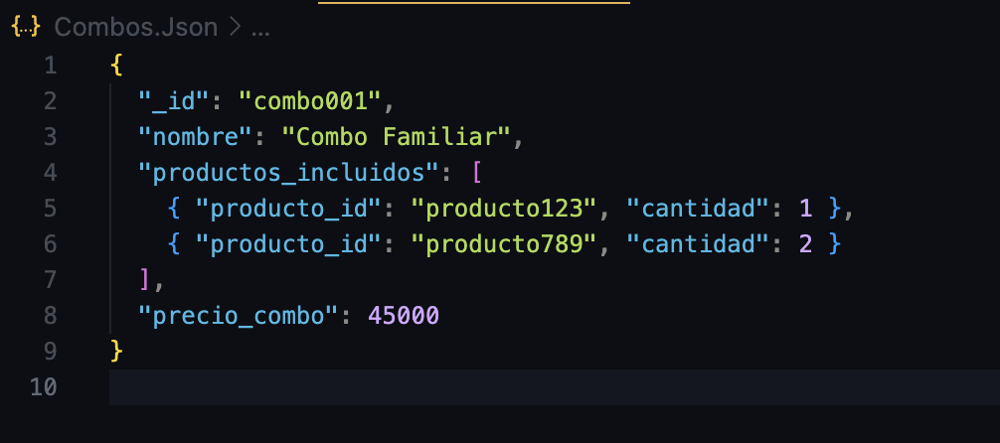
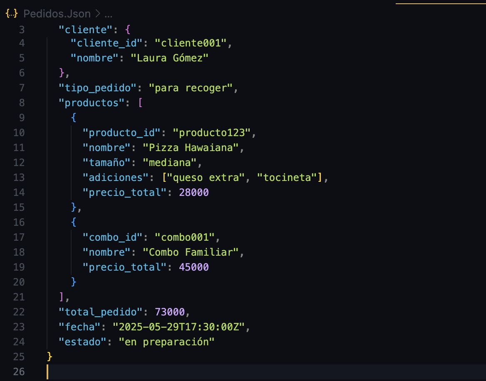
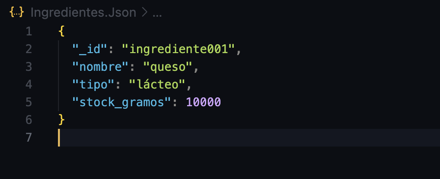
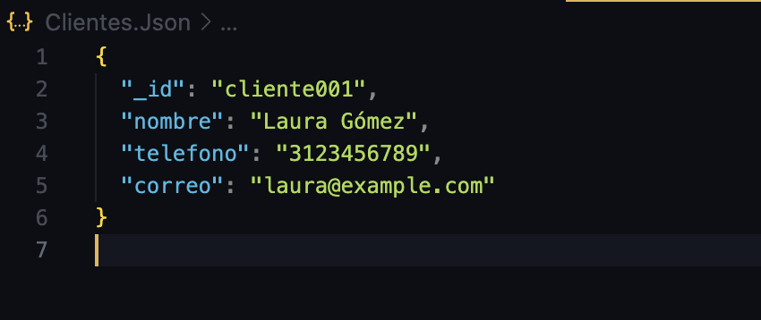

# Modelado-NoSQL-Documental-con-MongoDB-para-una-Pizzer-a

1. Investigar en equipo:

- ¿Qué es una base de datos NoSQL?:

  Una base de datos NoSQL, es un sistema de gestión de bases de datos no relacional que almacena datos en un formato no tabular, a diferencia de las bases de     datos relacionales que utilizan tablas para organizar   la información.
 
  En otras palabras, las bases de datos NoSQL ofrecen una alternativa a las bases de datos relacionales (SQL) al permitir almacenar y recuperar datos en          formatos más flexibles, como documentos, pares
  clave- valor, o grafos. Estas bases de datos son ideales para aplicaciones que manejan grandes volúmenes de datos no estructurados o semiestructurados y que    requieren flexibilidad en el esquema de datos. 

- ¿Qué es MongoDB?

  Es un software de base de datos NoSQL que gestiona información orientada a documentos. Una de las características clave de MongoDB es su velocidad. Para        devolver las consultas más rápidamente, MongoDB puede      utilizar operadores para realizar funciones específicas.

- ¿Qué diferencia hay entre una base de datos relacional (como MySQL) y una base de datos documental como MongoDB?

    La principal diferencia entre una base de datos relacional como MySQL y una base de datos documental como MongoDB radica en su forma de almacenar y             estructurar los datos. MySQL utiliza un esquema fijo,      
    almacenando datos en tablas con filas y columnas, mientras que MongoDB almacena datos en documentos flexibles, generalmente en formato JSON, sin un esquema     fijo.

- ¿Qué son documentos y colecciones en MongoDB?
   los documentos son la unidad básica de almacenamiento de datos, similares a las filas en una base de datos relacional, pero con una estructura flexible. Las    colecciones son conjuntos de documentos, similar a las tablas en una base de datos relaciona

- ¿Qué información tendría un documento de pedido? ¿Y un producto?

  El documento de producto traeria la sigueinte informacion como 
  -id
  -nombre
  -tipo
  -precio_base
  -ingredientes 
  -disponible 

  El documento de pedido traeria la sigueinte informacion como 
  -id_pedido
  -cliente
    -id_cliente
    -nombre
  -tipo_pedido
  -productos 
    -producto_id
    -nombre
    -tamaño
    -adiciones 
    -precio_total
      
    -combo_id
    -nombre
    -precio_total
  -total_pedido
  -fecha
  -ingredientes
    -id
    -nombre
    -tipo
    -stock_gramos

¿Qué iría dentro del documento y qué se referenciaría?

  -Dentro de productos iria
  {
  "id": "0001",
  "nombre": "Pizza cabaronia",
  "tipo": "pizza",
  "tamaño": "mediana",
  "precio_base": 26000,
  "ingredientes": ["queso", "cabano", "jamón"],
  "disponible": true
  }
  

  -Dentro de combos irira 
  {
  "_id": "01",
  "nombre": "Combo Familiar",
  "productos_incluidos": [
    { "producto_id": "producto123", "cantidad": 1 },
    { "producto_id": "producto789", "cantidad": 2 }
  ],
  "precio_combo": 45000
  }

  -Dentro de pedidos iria 
  {
  "_id": "0001",
  "cliente": {
    "cliente_id": "cliente001",
    "nombre": "Laura Gómez"
  },
  "tipo_pedido": "para recoger",
  "productos": [
    {
      "producto_id": "0001",
      "nombre": "Pizza cabaronia ",
      "tamaño": "mediana",
      "adiciones": ["queso extra"],
      "precio_total": 30000
    },
    {
      "combo_id": "001",
      "nombre": "Combo Familiar",
      "precio_total": 45000
    }
  ],
  "total_pedido": 73000,
  "fecha": "2025-10-28T17:30:00Z",
  }

  -Dentro de ingredientes iria 
  {
  "_id": "I001",
  "nombre": "queso",
  "tipo": "lácteo",
  "stock_gramos": 3300
  }

-Dentro de clientes iria 
{
  "_id": "cliente001",
  "nombre": "Laura Gómez",
  "telefono": "3123456789",
  "correo": "laura@example.com"
 }

- ¿Qué campos serían listas, objetos u otros documentos incrustados?

| Campo                   | Tipo                | 
| ----------------------- | ------------------- | 
| `ingredientes`          | Lista               | 
| `productos_incluidos`   | Lista de objetos    | 
| `productos` (en pedido) | Lista de objetos    | 
| `adiciones`             | Lista               | 
| `cliente` (en pedido)   | Objeto (incrustado) | 
| `producto` (en pedido)  | Objeto (incrustado) | 

4. Reflexionar
¿Qué fue lo más difícil de imaginar sin tablas?

Lo más difícil fue imaginar cómo organizar los datos sin depender de claves foráneas ni relaciones normalizadas. En bases de datos relacionales estamos acostumbrados a separar todo en tablas distintas, pero en mongo, muchas veces es mejor reunir la información dentro de documentos, cosa que demanda de pensar de forma diferente y entender cómo se accede a los datos en un sistema documental.

¿Qué nos gustó del enfoque con documentos?

Nos gustó la flexibilidad que ofrece mongo para guardar datos relacionados dentro del mismo documento, lo que hace más sencilla la lectura de datos en muchos casos, cosa que facilita mucho el diseño en aplicaciones donde la lectura es más frecuente que las actualizaciones.

¿Qué dudas surgieron al pensar en este nuevo tipo de base de datos?

Tuvimos dudas sobre cuándo es mejor incrustar documentos y cuándo referenciar, por ejemplo si los productos cambian de precio o de nombre, o tambien los ingredientes, deberían estar incrustados o referenciados? También nos preguntamos cómo se manejan las actualizaciones masivas en documentos grandes y qué tan eficiente es mongo en esos casos.
